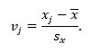
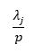
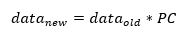
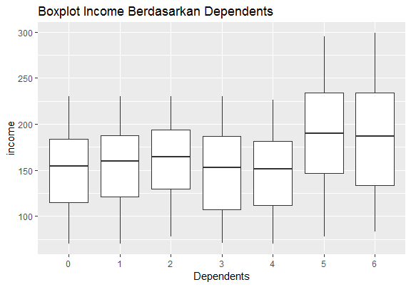
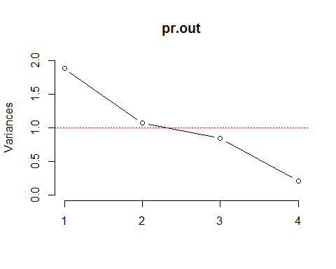
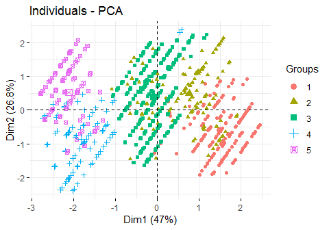

Overview Principal Component Analysis
Principal Component Analysis (PCA) adalah salah satu metode reduksi dimensi pada machine learning. PCA akan memilih “variabel-variabel” yang mampu menjelaskan sebagian besar variabilitas data. Bila anda familiar dengan analisis statistika Regresi, konsep variabilitas ini mirip dengan koefisien determinasi R2.
PCA mengurangi dimensi dengan membentuk variabel-variabel baru yang disebut Principal Components yang merupakan kombinasi linier dari variabel-variabel lama. Misalnya sebuah data set memiliki 3 variabel, x1, x2 dan x3. Sebuah principal component merupakan rata-rata tertimbang seperti berikut ini:

Yang dimaksud linier pada konteks ini adalah linier dalam variabel.
Pada contoh PC1 = 0.674x1 + 0.664x2 + 0.330x3, variabel x1, x2, x3 masing-masing berpangkat 1.
Pada contoh PC3 = 0.5x12 + 0.664√x2 + log20.330x3, variabel x1, x2 dan x3 tidak berpangkat 1.
Principal Component ini dipilih dengan syarat-syarat sebagai berikut:

setiap Principal Component memberikan varians terbesar,
setiap Principal Component tidak memiliki korelasi dengan PC lain dan
panjang vektor yang memuat koefisien-koefisien PC ini adalah 1.
Pada gambar pertama menunjukkan variabilitas data lebih tinggi pada arah Principal Component pertama (garis biru) dibandingkan dengan arah Principal Component kedua (garis merah). Pada gambar kedua data lebih banyak bervariasi searah dengan sumbu X dibandingkan dengan arah sumbu Y. Variabilitas pada data dapat diaproksimasi hanya dengan menggunakan Princicipal Component 1 yang terletak sejajar dengan sumbu X.

Analogi principal component mirip dengan tusuk sate. Pada gambar pertama kita akan meletakkan tusuk sate pertama (warna biru) untuk menusuk sebanyak mungkin potongan daging yang berserakan. Sebagian daging yang belum tertusuk oleh tusuk sate pertama, akan ditusuk oleh tusuk sate kedua (warna merah). Pada gambar kedua sebagian besar potongan daging mengarah sejajar dengan sumbu X, sehingga hanya diperlukan satu tusuk sate saja (warna biru).
Konsep dasar dari PCA adalah melakukan aproksimasi dengan mencari variabel-variabel yang memberikan variabilitas terbesar pada data lalu meletakkan “sumbu-sumbu” principal component agar hubungan antar variabel (korelasi antar variabel) menjadi minimal. Penghitungan Varians dan Principal Component ini dapat dilakukan dengan menggunakan konsep nilai eigen (eigenvalue) dan vektor eigen (eigenvector) dari ilmu Aljabar Linier. Nilai-nilai eigen menunjukkan kontribusi suatu principal component terhadap varians data. Vektor-vektor eigen memberikan koefisien-koefisien Principal Components. Banyaknya Principal Components yang akan dipilih disesuaikan dengan batasan yang diinginkan atau dengan menggunakan Screeplot. Cara menghitung nilai eigen dan cara memperoleh vektor-vektor eigen dibahas pada bab reviu Aljabar Linier.

---

Asumsi-asumsi
Asumsi-asumsi yang harus dipenuhi agar teknik Principal Component Analysis dapat berjalan dengan baik:

Tipe variabel adalah numerik.
Variabel-variabel yang menjadi input PCA adalah variabel prediktor.
Variabel-variabel prediktor memiliki hubungan linier.
Semua variabel harus distandarisasi (centered dan scaled).

---

Langkah-Langkah Principal Component Analysis
Berikut ini adalah langkah-langkah yang diperlukan untuk melakukan Principal Component Analysis:

Menyiapkan data (standardisasi data),
Menghitung matrik kovarians atau matrik korelasi,
Menghitung nilai eigen dan vektor eigen dari matrik korelasi,
Memilih principal component,
Visualisasi output,
Menghitung skor baru.
Cara kerja teknik Principal Component Analysis adalah memilih principal component yang memberikan varians terbesar. Cara kerja metode PCA menyebabkan metode ini sangat sensitif terhadap nilai variabel yang berbeda-beda atau terhadap skala variabel yang berbeda. Agar PCA tidak salah “memilih” variabel, maka variabel-variabel input perlu distandarisasi. Standarisasi variabel dilakukan dengan cara mengurangi setiap observasi pada variabel tersebut dengan mean variabel dan membagi dengan simpangan baku variabel.

Koefisien korelasi menunjukkan kuatnya hubungan linier antara 2 buah variabel. Hubungan antar 2 variabel untuk semua variabel prediktor dalam data dapat dilihat pada matrik korelasi. Koefisien korelasi yang tinggi (mendekati 1 untuk hubungan linier yang searah atau mendekati -1 untuk hubungan linier yang berlawanan arah) merupakan indikasi redundancy. Di sinilah teknik PCA dapat digunakan untuk mengurangi dimensi dengan cara memilih “variabel-variabel” baru yang tidak saling berkorelasi yang mampu menjelaskan sebagian besar variabilitas data.

Dari matrik korelasi didapatkan informasi mengenai kekuatan hubungan linier antara variabel. Tujuan kita melakukan PCA adalah memilih variabel-variabel yang memberikan varians terbesar dengan cara meminimalkan distorsi antara variabel. Hal ini dilakukan dengan cara menghitung nilai eigen dan vektor eigen dari matrik korelasi. “Variabel baru” principal component didapatkan dari vektor eigen dan merupakan kombinasi linier dari variabel lama. Koefisien-koefisien tersebut menunjukkan besarnya bobot variabel-variabel lama dalam masing-masing principal component.

Berapa banyaknya principal component yang dipilih? Ada beberapa kriteria yang dapat digunakan untuk menentukan k:

Batasan variabilitas, misalnya 80%.
Kriterion Kaiser: memilih semua PC yang nilai eigennya yang lebih besar dari 1.
Memilih k Principal Component.
Dalam modul ini kita akan memilih p Principal Component pertama yang nilai eigennya lebih dari 1 sampai dengan batasan variabilitas tertentu. Mengapa nilai eigen yang dipilih adalah nilai eigen yang lebih dari 1? Sebuah PC yang nilai eigennya lebih dari 1 mampu menjelaskan variabilitas data yang lebih besar daripada variabel-variabel asal.

Besarnya kontribusi sebuah principal component terhadap variabilitas data dapat dihitung dengan rumus

di mana λj adalah nilai eigen ke j dan p adalah total banyaknya variabel.

Visualisasi output PCA dapat dilakukan dengan menggunakan biplot. Plot ini menampilkan skor dan loading dalam grafik yang sama dengan menggunakan 2 Principal Component yang paling penting. Sumbu horizontal menampilkan PC pertama, sumbu vertikal menampilkan PC kedua. Variabel-variabel yang memiliki kontribusi besar terhadap PC1 akan digambarkan mendatar dan variabel-variable yang memiliki kontribusi tinggi terhadap PC2 akan digambarkan pada arah vertikal.

Skor variabel lama akan ditransformasi menjadi skor variabel baru dengan menggunakan rumus

---

Package dan Fungsi R
Berikut ini adalah package dan fungsi R yang akan digunakan dalam modul PCA.

cor() dari library stats untuk menghitung korelasi matrik.
eigen() dari library base untuk menghitung nilai eigen dan vektor eigen
prcomp() dari library stats untuk analisa Principal Component
princomp() dari library stats untuk analisa Principal Component
screeplot() dari library stats untuk membuat screeplot
biplot() dari library stats untuk membuat biplot.
autoplot() dari package ggfortify untuk membuat biplot.
fviz_pca_ind() dari package factoextra untuk membuat biplot.

---

Package dan Fungsi R | Fungsi prcomp() dan princomp()
R menyediakan fungsi prcomp() dan princomp() untuk melakukan Principal Component Analysis.

prcomp(x, center = TRUE, scale. = FALSE)
Deskripsi

Argumen x adalah dataframe berisi variabel numerik atau matrik.
R secara otomatis akan melakukan standarisasi data bila argumen center = TRUE dan scale = TRUE diaktifkan.
Output stdev adalah akar dari nilai eigen.
Output center menghasilkan mean dari nilai-nilai suatu variabel (mean kolom dalam struktur data yang digunakan pada contoh).
Output scale menghasilkan standard deviation untuk nilai-nilai suatu variabel (column mean dalam struktur data) yang digunakan pada contoh).
Output principal component sdev menghasilkan nilai standard deviation yang digunakan untuk menghitung kontribusi suatu principal component terhadap variabilitas data.
Output rotation menampilkan loading Principal Component yang akan digunakan untuk menghitung skor data pada sistem koordinat baru. Koefisien-koefisien pada vektor-vektor Principal Component menunjukkan besarnya korelasi antara variabel dengan Principal Component.
Output x menampilkan skor data pada “sistem koordinat baru”.

---

Studi Kasus: 4 Variabel
Pada bagian ini kita akan menggunakan data credit rating untuk berlatih menggunakan metode PCA. Kita akan mereduksi data set dengan 4 variabel numerik prediktor menjadi 2 Principal Component.

## 'data.frame': 900 obs. of 6 variables:

## $ contractcode: chr "AGR-000001" "AGR-000011" "AGR-000030" "AGR-000043" ...

## $ income : num 295 271 159 210 165 220 70 88 163 100 ...

## $ tenor : num 48 36 12 12 36 24 36 48 48 36 ...

## $ dependents : num 5 5 0 3 0 5 3 3 5 6 ...

## $ midoverdue : num 75.5 75.5 0 53 38 15 38 38 38 38 ...

## $ riskrating : num 4 4 1 3 2 1 2 2 2 2 ...

Deskripsi variabel dalam dataset credit rating ini adalah sebagai berikut:

contractcode: nomor kontrak
income: penghasilan per tahun dalam jutaan rupiah.
tenor : durasi pinjaman
dependents: banyaknya tanggungan. \* midoverdue: rata-rata keterlambatan pembayaran pinjaman dalam hari.
risk rating: rating resiko
Variabel respons pada dataset ini adalah risk rating. Variabel-variabel lain adalah variabel prediktor.

Variabel yang akan digunakan untuk analisa PCA adalah variabel prediktor dengan tipe data numerik, yaitu

## [1] "income" "tenor" "dependents" "midoverdue"

Langkah-langkah yang akan dilakukan adalah:

Melakukan eksplorasi data dengan teknik statistika deskriptif.
Membagi dataset menjadi training set dan testing set.
Menerapkan Principal Component Analysis.
Memilih banyaknya principal component.
Visualisasi output.

---

Sebelum melakukan reduksi dimensi dengan PCA, terlebih dahulu kita melakukan eksplorasi data dengan teknik statistika deskriptif.

## income tenor dependents midoverdue

## Min. : 70.0 Min. :12.0 Min. :0.000 Min. :15.00

## 1st Qu.:120.0 1st Qu.:12.0 1st Qu.:1.000 1st Qu.:15.00

## Median :162.0 Median :24.0 Median :3.000 Median :53.00

## Mean :162.4 Mean :29.8 Mean :2.929 Mean :48.08

## 3rd Qu.:197.0 3rd Qu.:48.0 3rd Qu.:5.000 3rd Qu.:53.00

## Max. :299.0 Max. :48.0 Max. :6.000 Max. :91.00

Dari boxplot distribusi income berdasarkan dependents dapat disimpulkan bahwa tidak terdapat perbedaan besar pada median dan sebaran penghasilan individu-individu tidak memiliki tanggungan sampai dengan yang memiliki 4 tanggungan. Median dan sebaran penghasilan kelompok dengan 5 dan 6 dependen lebih besar dibandingkan dengan 5 kelompok sebelumnya.

Matriks korelasi memberikan informasi kekuatan hubungan linier antara variabel. Terlihat hubungan paling kuat adalah hubungan antara dependents dan midoverdue disusul oleh hubungan antara income dan dependents.

## income tenor dependents midoverdue

## income 1.00000000 -0.04649806 0.25180228 0.1599918

## tenor -0.04649806 1.00000000 0.00526126 0.2100942

## dependents 0.25180228 0.00526126 1.00000000 0.7615983

## midoverdue 0.15999175 0.21009415 0.76159830 1.0000000

---

Split Dataset
Dataset yang akan digunakan untuk training dan testing perlu dipisahkan agar informasi yang digunakan untuk testing tidak “bocor” ke dataset yang digunakan untuk training. Sebanyak 80% data akan digunakan untuk training, sisanya dialokasikan untuk testing.
Teknik sampling yang akan digunakan adalah stratified sampling dengan menggunakan risk rating sebagai stratum. Alasan menggunakan stratified sampling adalah agar risk rating yang berbeda-beda bisa terwakili dalam dataset training dan mencegah kemungkinan memperoleh PCA yang dihasilkan dari training dataset yang hanya mengandung risk rating tertentu.
Proporsi untuk setiap risk rating pada training set akan diterapkan untuk testing set. PCA akan diterapkan pada training dataset.

---

PCA dengan prcomp()

## Standard deviations (1, .., p=4):

## [1] 1.3709060 1.0347230 0.9176641 0.4559141

##

## Rotation (n x k) = (4 x 4):

## PC1 PC2 PC3 PC4

## income -0.3038356 -0.5337512 -0.7861956 0.06848411

## tenor -0.1470943 0.8240099 -0.5179407 -0.17637573

## dependents -0.6649190 -0.1002035 0.2647878 -0.69117970

## midoverdue -0.6662807 0.1614826 0.2086176 0.69747555

Dari output rotation didapatkan loading Principal Component

PC1 = (-0.304)income + (-0.147)tenor + (-0.665)dependents + (-0.666)midoverdue

PC2 = (-0.534)income + (0.824)tenor + (-0.1)dependents + (0.161)midoverdue

PC3 = (-0.786)income + (-0.518)tenor + (0.265)dependents + (0.209)midoverdue

PC4 = (0.068)income + (-0.176)tenor + (-0.691)dependents + (0.697)midoverdue

di mana sebuah PC merupakan rata-rata tertimbang dari variabel income sampai dengan midoverdue. Pada PC1 terlihat variabel dependents dan midoverdue dominan sedangkan pada PC2 variabel dominan adalah income dan tenor. PC3 dan PC4 memiliki pola yang sama dengan PC1 dan PC2.

---

Dark Mode

Banyaknya Principal Component

## Importance of components:

## PC1 PC2 PC3 PC4

## Standard deviation 1.3709 1.0347 0.9177 0.45591

## Proportion of Variance 0.4698 0.2677 0.2105 0.05196

## Cumulative Proportion 0.4698 0.7375 0.9480 1.00000

Nilai-nilai eigen

## [1] 1.8793832 1.0706518 0.8421074 0.2078577

Penerapan kriterion Kaiser pada Screeplot menghasilkan 2 PC, yaitu PC1 dan PC2 yang menjelaskan sebanyak 74% variabilitas dalam data. Hal ini juga konsisten dengan inspeksi rotasi pada bagian sebelumnya, dimana PC3 dan PC4 merupakan pengulangan pola pada PC1 dan PC2.

Pada tahap ini dataset dengan 4 variabel numerik income, tenor, dependents dan midoverdue telah berhasil direduksi menjadi 2 “variabel” PC1 dan PC2.

---

Visualisasi Output

Pada biplot terlihat variabel dependents dan midoverdue memberikan paling banyak kontribusi pada arah PC1. Variabel income dan tenor berkontribusi pada arah PC1.PC2 dapat diberi nama “Beban” dan PC2 dapat diberi nama “Kemampuan Membayar”.

Sudut antara 2 vektor variabel menunjukkan kekuatan hubungan 2 variabel. Sudut lancip di antara midoverdue dan dependents menunjukkan korelasi yang kuat sedangkan sudut tumpul di antara income dan tenor menunjukkan korelasi yang lemah.

## income tenor dependents midoverdue

## income 1.00000000 -0.04649806 0.25180228 0.1599918

## tenor -0.04649806 1.00000000 0.00526126 0.2100942

## dependents 0.25180228 0.00526126 1.00000000 0.7615983

## midoverdue 0.15999175 0.21009415 0.76159830 1.0000000

---

Keterbatasan PCA
Dalam praktek Principal Component-Principal Component diberi nama tersendiri berdasarkan ringkasan variabel-variabel yang dominan. Hal ini memerlukan pengetahuan domain dan ada kalanya variabel-variabel yang muncul kurang sesuai dengan teori pada domain.
Cara kerja PCA dalam mereduksi dimensi adalah membentuk Principal Component-Principal Component yang memberikan variabilitas data terbesar. Keterbatasan PCA adalah proses pemilihan PC hanya dilakukan dengan variabel-variabel prediktor. Oleh karena itu PCA sebaiknya bukan digunakan sebagai model namun digunakan sebagai teknik preprocessing data untuk kemudian menjadi input metode lain. Alternatif lain adalah menggunakan metode Partial Least Squares yang melibatkan variabel respons dalam reduksi dimensi.
